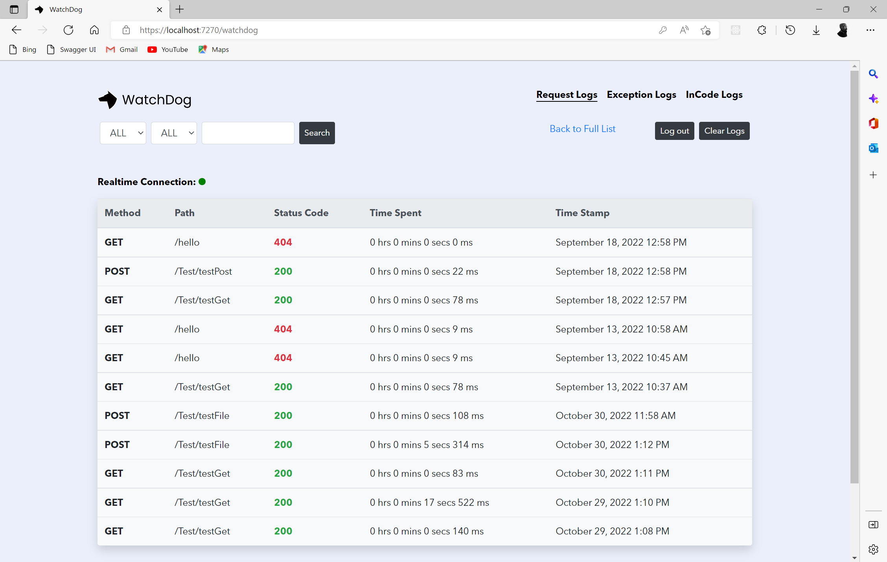

# WatchDog Documentation

<figure><figcaption></figcaption></figure>

## WatchDog 

    

### Introduction 

WatchDog is a Realtime Message, Event, HTTP (Request & Response) and Exception logger and viewer for ASP.Net Core Web Apps and APIs. It allows developers log and view messages, events, http requests made to their web application and also exception caught during runtime in their web applications, all in Realtime. It leverages `SignalR` for real-time monitoring and `LiteDb` a Serverless MongoDB-like database with no configuration with the option of using your external databases (MSSQL, MySQl, Postgres, MongoDB).

<figure><figcaption></figcaption></figure>

### General Features 

* RealTime HTTP Request, Response, and Exception Logger
* In-code message and event logging
* User Friendly Logger Views
* Search Option for HTTP and Exception Logs
* Filtering Option for HTTP Logs using HTTP Methods and StatusCode
* Logger View Authentication
* Auto Clear Logs Option

### [Getting Started](getting-started.md) 

### Credit

Kelechi Onyekwere - [Github](https://github.com/Khelechy) [Twitter](https://twitter.com/khelechy1337)

Israel Ulelu - [Github](https://github.com/IzyPro) [Twitter](https://twitter.com/IzyPro\_)

#### &#x20;

#### &#x20;

### &#x20;
