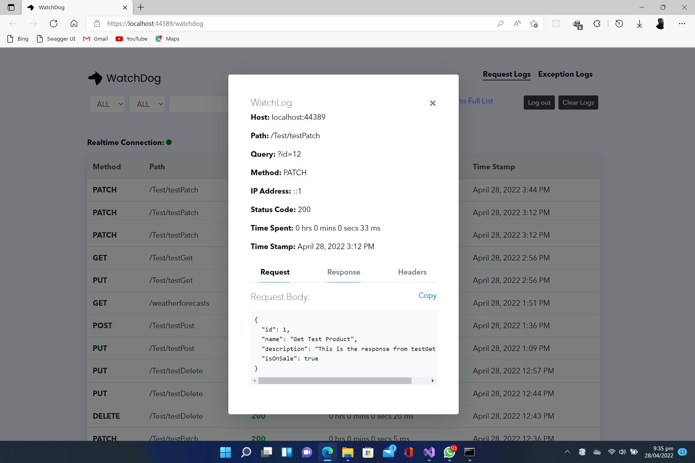

# Configurations

#### AddWatchDogServices() Optional Configurations <a href="#https-github.com-izypro-watchdog-setup-autoclear-logs-optional" id="https-github.com-izypro-watchdog-setup-autoclear-logs-optional"></a>

* IsAutoClear: Clears logs after a specific duration (Default = Weekly).
* ClearTimeSchedule: Duration for logs to clear automatically.
* SetExternalDbConnString: Specifies connection string for an external database.
* DbDriverOption: Database type for the connection string (Options = MSSQL, MySQL, Postgres, Mongo).

```c#
services.AddWatchDogServices(opt => 
{ 
   opt.IsAutoClear = true;
   opt.ClearTimeSchedule = WatchDogAutoClearScheduleEnum.Monthly;
   opt.SetExternalDbConnString = "Server=localhost;Database=testDb;User Id=postgres;Password=root;"; 
   opt.DbDriverOption = WatchDogSqlDriverEnum.PostgreSql; 
});
```

**UseWatchDog() Optional Configurations**

* Blacklist: List of routes, paths or endpoints to be ignored (should be a comma separated string like below).
* Serializer: If not default, specify the type of global json serializer/converter used
* CorsPolicy: Policy Name if project uses CORS

```c#
app.UseWatchDog(opt => 
{ 
   opt.WatchPageUsername = "admin"; 
   opt.WatchPagePassword = "Qwerty@123"; 
   //Optional
   opt.Blacklist = "Test/testPost, api/auth/login"; //Prevent logging for specified endpoints
   opt.Serializer = WatchDogSerializerEnum.Newtonsoft; //If your project use a global json converter
   opt.CorsPolicy = "MyCorsPolicy"
 });
```

<figure><figcaption></figcaption></figure>

****

****

#### &#x20;<a href="#https-github.com-izypro-watchdog-view-logs-and-exception" id="https-github.com-izypro-watchdog-view-logs-and-exception"></a>
