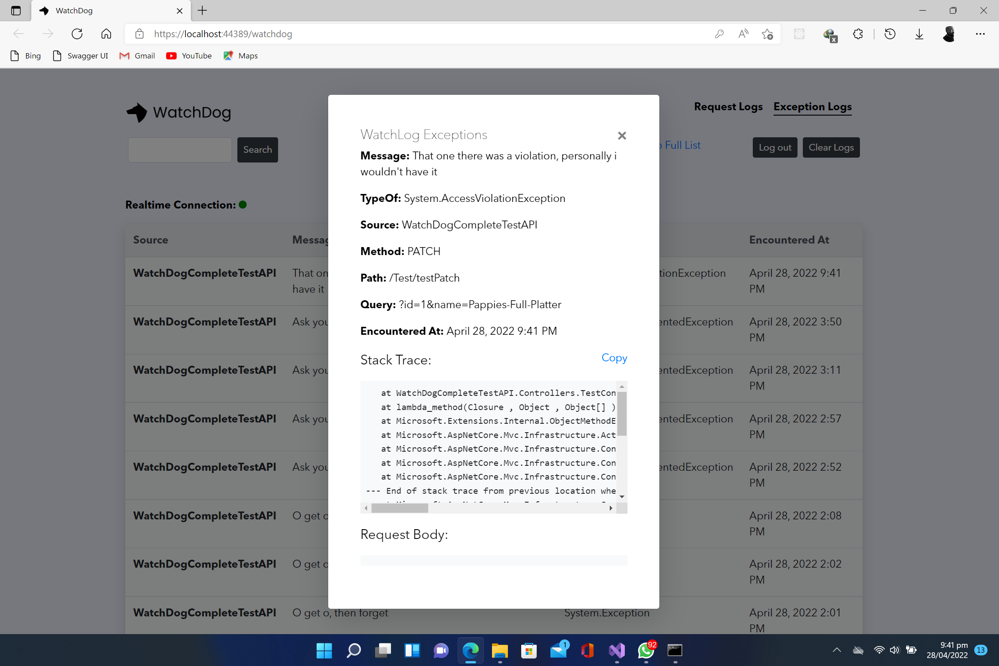

# Exceptions

**Add WatchDog Exception Logger `Optional`**

This is used to log in-app exceptions that occur during a particular HTTP request.

<figure><figcaption></figcaption></figure>

> **NOTE** Add Exception Logger before the main WatchDog Middleware, preferably at the top of the middleware hierarchy so as to catch possible early exceptions.

```c#
app.UseWatchDogExceptionLogger();

...

app.UseWatchDog(opt => 
{ 
   opt.WatchPageUsername = "admin"; 
   opt.WatchPagePassword = "Qwerty@123"; 
   ...
 });
```
