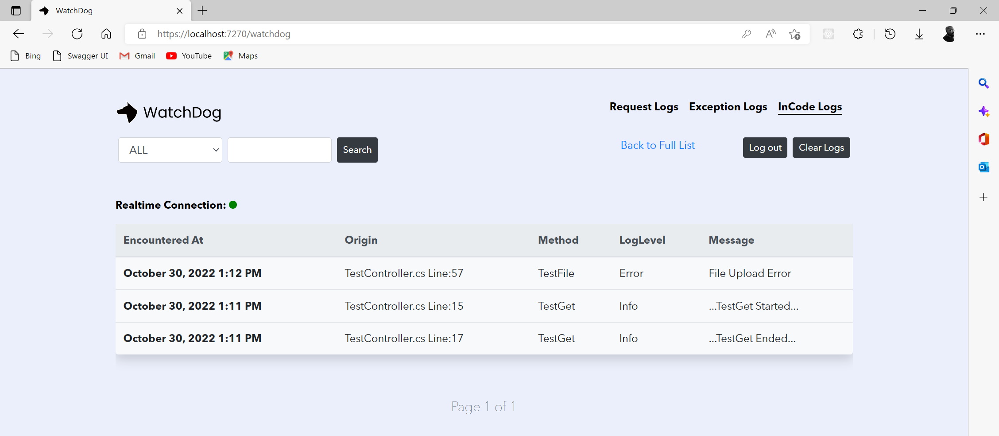

# In-Code Logs

### Log Messages/Events <a href="#https-github.com-izypro-watchdog-log-messagesevents" id="https-github.com-izypro-watchdog-log-messagesevents"></a>

```
WatchLogger.Log("...Test Log...");
WatchLogger.LogWarning(JsonConvert.Serialize(model));
WatchLogger.LogError(res.Content, eventId: reference);
```

<figure><figcaption></figcaption></figure>

### **Sink Logs from ILogger**

You can also sink logs from the .NET ILogger into WatchDog

#### For .NET 5 and above

```
builder.Logging.AddWatchDogLogger();
```

#### For .NET Core 3.1

```
Host.CreateDefaultBuilder(args)
 .ConfigureLogging( logging =>
 {
     logging.AddWatchDogLogger();
 })
 .ConfigureWebHostDefaults(webBuilder =>
 {
     webBuilder.UseStartup<Startup>();
 });
```
