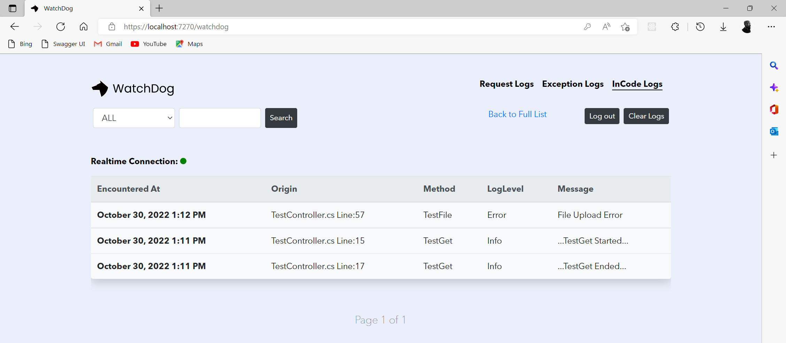

# Request and Response Logs

#### Add WatchDog middleware in the HTTP request pipeline in `Startup.cs` under `Configure()` <a href="#https-github.com-izypro-watchdog-add-watchdog-middleware-in-the-http-request-pipeline-in-startupcs-u" id="https-github.com-izypro-watchdog-add-watchdog-middleware-in-the-http-request-pipeline-in-startupcs-u"></a>

<figure><figcaption></figcaption></figure>

> **NOTE** Add Authentication option like below: `Important`

This authentication information (Username and Password) will be used to access the log viewer.

```c#
app.UseWatchDog(opt => 
{ 
   opt.WatchPageUsername = "admin"; 
   opt.WatchPagePassword = "Qwerty@123"; 
 });
```

> **NOTE** If your project uses authentication, then `app.UseWatchDog();` should come after app.UseRouting(), app.UseAuthentication(), app.UseAuthorization(), in that order

<figure><figcaption></figcaption></figure>

**Optional Configurations: `Optional`**

* Blacklist: List of routes, paths or endpoints to be ignored (should be a comma separated string like below).
* Serializer: If not default, specify the type of global json serializer/converter used
* CorsPolicy: Policy Name if project uses CORS

```c#
app.UseWatchDog(opt => 
{ 
   opt.WatchPageUsername = "admin"; 
   opt.WatchPagePassword = "Qwerty@123"; 
   //Optional
   opt.Blacklist = "Test/testPost, api/auth/login"; //Prevent logging for specified endpoints
   opt.Serializer = WatchDogSerializerEnum.Newtonsoft; //If your project use a global json converter
   opt.CorsPolicy = "MyCorsPolicy"
 });
```

****

#### Log Messages/Events <a href="#https-github.com-izypro-watchdog-log-messagesevents" id="https-github.com-izypro-watchdog-log-messagesevents"></a>

```
WatchLogger.Log("...Test Log...");
WatchLogger.LogWarning(JsonConvert.Serialize(model));
WatchLogger.LogError(res.Content, eventId: reference);
```

<figure><figcaption></figcaption></figure>

****

#### &#x20;<a href="#https-github.com-izypro-watchdog-view-logs-and-exception" id="https-github.com-izypro-watchdog-view-logs-and-exception"></a>
